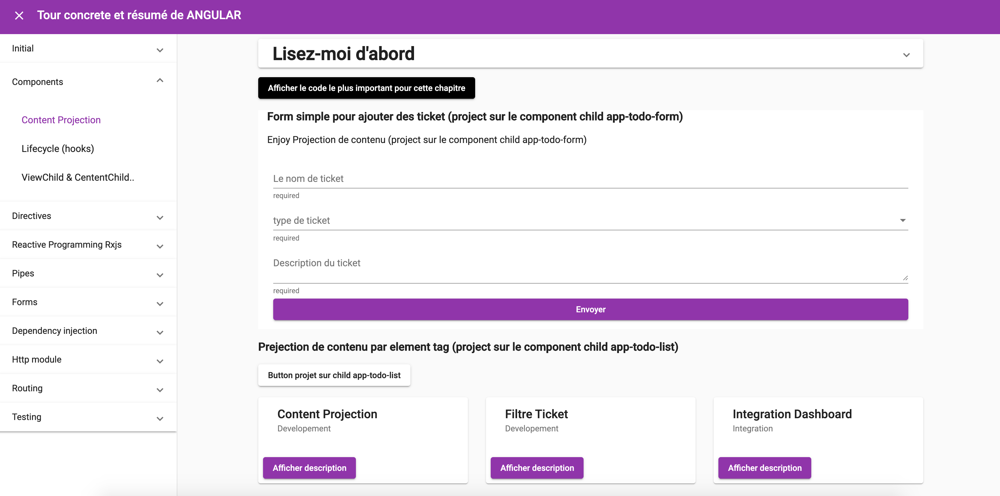

# Angular concrete and summarized tour 
Un tour concrète de tous les parties importantes d'angular, profitez de la lecture et du changement pour mieux comprendre :D

## Project requirements

### Development

-  NodeJS >= 10.15.3
-  Angular & @angular-cli = 11.0.6

## Project setup 

NodeJS is required.

- enter to `/angular-concrete-and-summarized-tour` and run  `npm install`

## Running project

- `ng serve` : Build the frontend application

- angular app : `localhost:4200`

