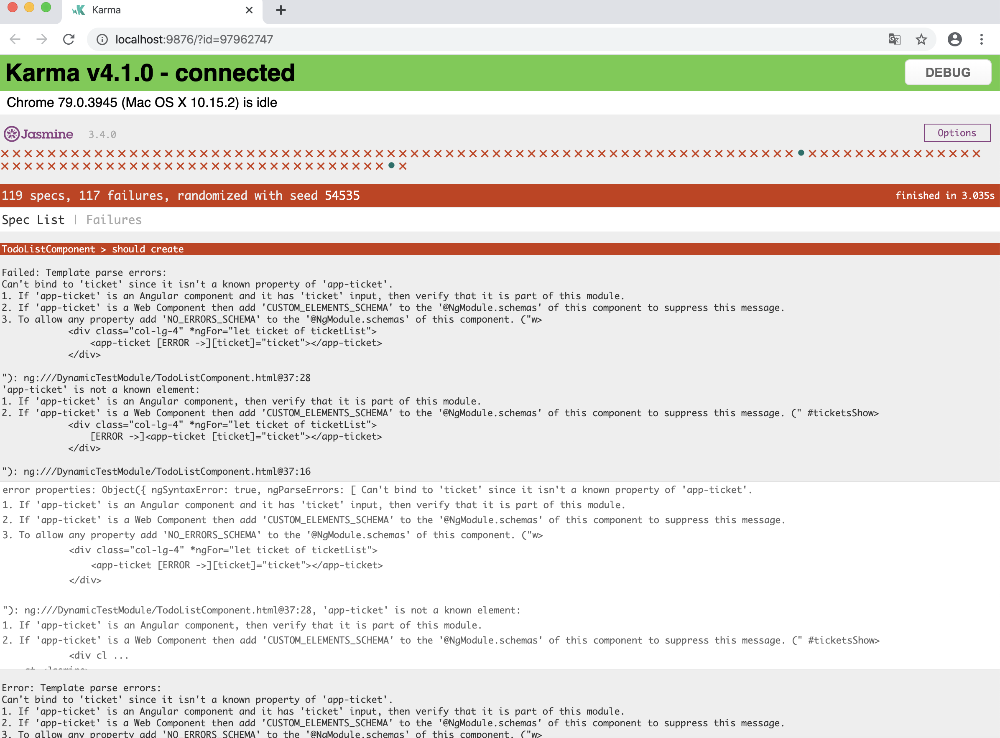
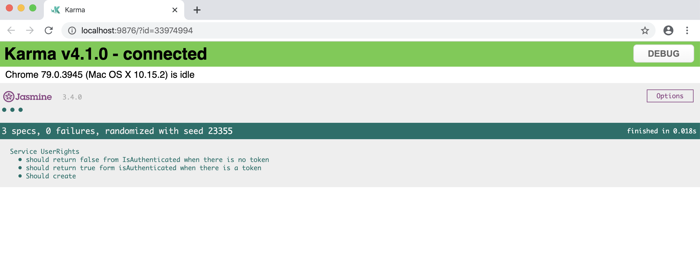
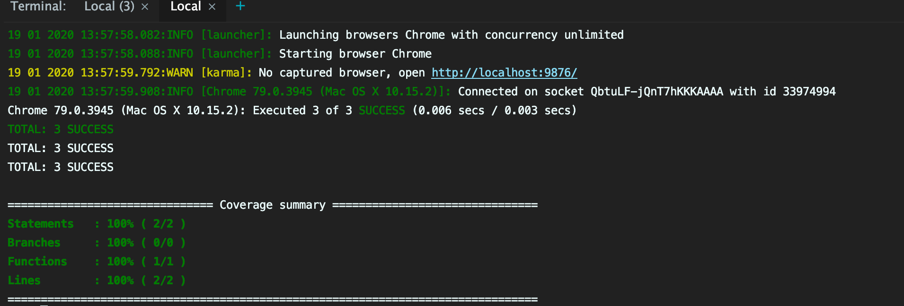
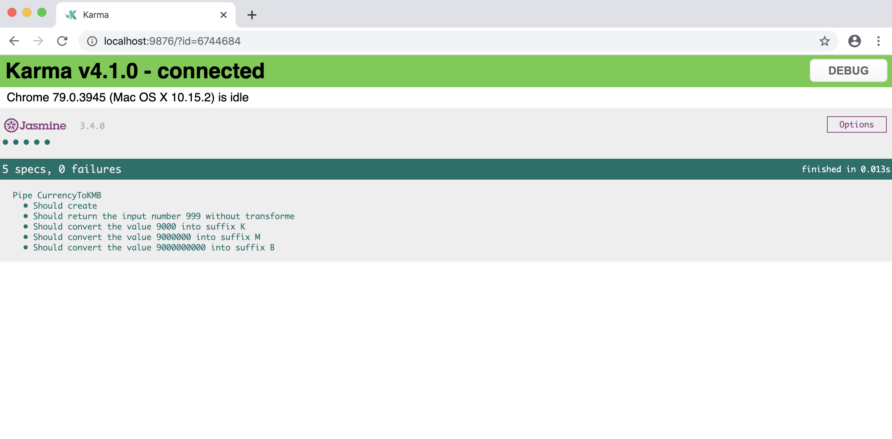
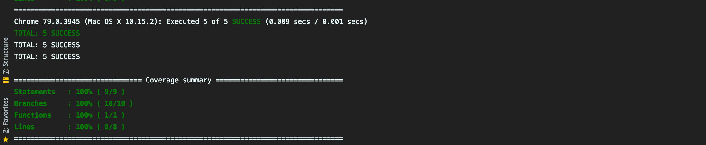

### Intro

#### General :(https://openclassrooms.com/fr/courses/5641591-testez-votre-application-c/5641598-pourquoi-tester-son-application)
Faire un test, c’est vérifier qu’une partie de son logiciel fonctionne comme attendu.
Si vous avez déjà développé, vous savez que la transformation d’une idée ou d'un besoin en code informatique peut être complexe et sujette à erreur ou interprétation.

En voici quelques raisons :

* Le besoin peut avoir été mal ou vaguement défini, que ce soit votre besoin ou celui d’un client. En conséquence, vous ne le développez pas comme il le faut.

* De la même façon, le besoin peut avoir été mal compris. Résultat : le logiciel ne correspond pas à ce qui est attendu.

* Vous avez fait des erreurs dans le code qui font que le logiciel plante, ou pire, qu’il ne fonctionne pas comme il faut ! Vous imaginez si le logiciel de votre banque vous retirait à chaque fois le double de ce que vous payez ?

* Ou encore plus insidieux, tout fonctionne bien, sauf dans des cas limites du logiciel. Par exemple, vous développez une calculatrice, elle fonctionne bien, sauf dans le cas où vous tentez de diviser quelque chose par zéro. Et là, boum 

#### Angular
Lorsque nous parlons de tests dans Angular, nous parlons généralement de deux types de tests différents:

* <strong>Tests unitaires</strong>

   Ceci est parfois également appelé test isolé. C'est la pratique de tester de petits morceaux de code isolés. Si votre test utilise une ressource externe, comme le réseau ou une base de données, ce n'est pas un test unitaire.

* <strong>Test fonctionel</strong>
    Ceci est défini comme le test de la fonctionnalité complète d'une application. Dans la pratique avec les applications Web, cela signifie interagir avec votre application car elle s'exécute dans un navigateur comme un utilisateur interagirait avec elle dans la vie réelle, c'est-à-dire via des clics sur une page.
    Ceci est également appelé test de EndToEnd ou E2E.
<hr/>

Nous pouvons tester nos applications angulaires à partir de zéro en écrivant et en exécutant des fonctions JavaScript pures.
Mais il existe un certain nombre de bibliothèques et de frameworks de test que nous pouvons utiliser, 
ce qui réduit le temps nécessaire pour écrire des tests.
Deux de ces outils et framworks qui sont utilisés lors du test d'Angular sont Jasmine et Karma.


### Jasmine

* Jasmine est un cadre de test JavaScript qui prend en charge une pratique de développement logiciel appelée Behavior-Driven Development, ou BDD.
* Le BDD combine les techniques et principes des (TDD,DDD,OOP) .
* Jasmine, et BDD en général, tente de décrire les tests dans un format lisible par l'homme afin que les personnes non techniques puissent comprendre ce qui est testé.
même pour nous lecture les tests au format BDD, il est beaucoup plus facile de comprendre ce qui se passe sur les projets..

Exemple : 

```
class Counter {
    //   ...
    public count = 0;
    
    public increaseItOnClick() : void {
        this.count++;
    }
    
    
}

// pure TYPESCRIPT counter.test.ts 

 public function itIncreaseByOne(counter:Counter) : string {
 
    counter.increaseItOnClick();
    if(counter.count === 1) {
       return 'Test valid';
    } else {
       return 'Test Fiald';
    }
 }
 
 const counter = new Counter();
 counter.increaseItOnClick();
 itIncreaseByOne(couner); // true : D
 
 
// JASMINE spec , counter.spec.ts
describe('Counter',() => {

    beforeAll(() => {
    });

    afterAll(() => {
    });
    beforeEach(() => {
    });
    afterEach(() => {
    });
    
    it('Should increase count by 1 after calling click', () => {
      let counter = new Counter();
      counter.increaseItOnClick();
      expect(counter.count).toEqual(1); // true :D
    });
    
    
    it(...)
    it(...)
    ...
});

```
#### Quelques mots clés de Jasmine 
(1)
* `describe(String, Function)` : <strong>String</strong> est un nom ou un titre pour une suite de spécifications , <string>Function</strong> définit la suite de tests , une list de spécifications de test individuelles (it).
* `it(String, Function)` :<strong>String</strong> est un nom ou un titre pour un spécification de test, <strong>Function</strong> définit une spécification de test individuelle, elle contient une ou plusieurs attentes (expects) de test.
* `expect(actual)` : expect est prend une valeur, appelée le réel. Il est enchaîné avec une fonction Matcher, qui prend la valeur attendue (expect(counter.count).toEqual(1)).

   Chaque Matcher implémente une comparaison booléenne entre la valeur réelle et la valeur expected. Il est responsable de signaler à Jasmine si expect est vraie ou fausse. Jasmine réussira ou échouera la spécification.
   
<strong>Nb<strong>: 
1) Désactiver sans commenter
* on peut désactiver une list de spécifications de test sans les commenter on ajoute juste x au départ `xdescribe(String, Function)`
* on peut désactiver une spécification de test sans les commenter on ajoute juste x au départ `xit(String, Function)`

1) se concentrer sur des tests et ignore les autres
* on peut se concentrer sur une list de spécifications et ignore les autre on ajoute juste f au départ `fdescribe(String, Function)`
* on peut se concentrer sur une spécification et ignore les autre on ajoute juste f au départ`fit(String, Function)`

(2) Setup and Teardown (Configuration et démontage)

Parfois, pour tester une fonctionnalité, nous devons effectuer une configuration,
peut-être que cela crée des objets de test. De plus, nous devrons peut-être effectuer certaines activités de nettoyage après avoir terminé les tests.
par exemple supprimer des fichier ...

* `beforeAll` : Cette fonction est appelée une fois, avant d'exécuter toutes les spécifications d'une suite de tests `describe function`
  
* `afterAll`  : Cette fonction est appelée une fois que toutes les spécifications d'une suite de tests sont terminées.
  
* `beforeEach`: Cette fonction est appelée avant l'exécution de chaque spécification de test (it function).
  
* `afterEach` : Cette fonction est appelée après l'exécution de chaque spécification de test.


#### Tout les mots clés de Jasmine
```
// Type definitions for jasminewd2 2.0
// Project: https://github.com/angular/jasminewd
// Definitions by: Sammy Jelin <https://github.com/sjelin>
//                 George Kalpakas <https://github.com/gkalpak>
// Definitions: https://github.com/DefinitelyTyped/DefinitelyTyped
// TypeScript Version: 2.8

/// <reference types="jasmine" />

declare function it(expectation: string, assertion?: (done: DoneFn) => Promise<void>, timeout?: number): void;
declare function fit(expectation: string, assertion?: (done: DoneFn) => Promise<void>, timeout?: number): void;
declare function xit(expectation: string, assertion?: (done: DoneFn) => Promise<void>, timeout?: number): void;
declare function beforeEach(action: (done: DoneFn) => Promise<void>, timeout?: number): void;
declare function afterEach(action: (done: DoneFn) => Promise<void>, timeout?: number): void;
declare function beforeAll(action: (done: DoneFn) => Promise<void>, timeout?: number): void;
declare function afterAll(action: (done: DoneFn) => Promise<void>, timeout?: number): void;

declare namespace jasmine {
  interface Matchers<T> {
    toBe(expected: any, expectationFailOutput?: any): Promise<void>;
    toEqual(expected: any, expectationFailOutput?: any): Promise<void>;
    toMatch(expected: string | RegExp | Promise<string | RegExp>, expectationFailOutput?: any): Promise<void>;
    toBeDefined(expectationFailOutput?: any): Promise<void>;
    toBeUndefined(expectationFailOutput?: any): Promise<void>;
    toBeNull(expectationFailOutput?: any): Promise<void>;
    toBeNaN(): Promise<void>;
    toBeTruthy(expectationFailOutput?: any): Promise<void>;
    toBeFalsy(expectationFailOutput?: any): Promise<void>;
    toHaveBeenCalled(): Promise<void>;
    toHaveBeenCalledWith(...params: any[]): Promise<void>;
    toHaveBeenCalledTimes(expected: number | Promise<number>): Promise<void>;
    toContain(expected: any, expectationFailOutput?: any): Promise<void>;
    toBeLessThan(expected: number | Promise<number>, expectationFailOutput?: any): Promise<void>;
    toBeLessThanOrEqual(expected: number | Promise<number>, expectationFailOutput?: any): Promise<void>;
    toBeGreaterThan(expected: number | Promise<number>, expectationFailOutput?: any): Promise<void>;
    toBeGreaterThanOrEqual(expected: number | Promise<number>, expectationFailOutput?: any): Promise<void>;
    toBeCloseTo(expected: number | Promise<number>, precision?: any, expectationFailOutput?: any): Promise<void>;
    toThrow(expected?: any): Promise<void>;
    toThrowError(message?: string | RegExp | Promise<string | RegExp>): Promise<void>;
    toThrowError(expected?: new (...args: any[]) => Error | Promise<new (...args: any[]) => Error>, message?: string | RegExp | Promise<string | RegExp>): Promise<void>;
  }

  interface ArrayLikeMatchers<T> extends Matchers<ArrayLike<T>> {
    toBe(expected: Expected<ArrayLike<T>>, expectationFailOutput?: any): Promise<void>;
    toEqual(expected: Expected<ArrayLike<T>>, expectationFailOutput?: any): Promise<void>;
    toContain(expected: T, expectationFailOutput?: any): Promise<void>;
    not: ArrayLikeMatchers<T>;
  }

  function addMatchers(matchers: AsyncCustomMatcherFactories): void;

  interface Env {
    addMatchers(matchers: AsyncCustomMatcherFactories): void;
  }

  interface Spec {
    addMatchers(matchers: AsyncCustomMatcherFactories): void;
  }

  interface AsyncCustomMatcherFactories {
    [index: string]: AsyncCustomMatcherFactory;
  }

  interface AsyncCustomMatcherFactory {
    (util: MatchersUtil, customEqualityTesters: CustomEqualityTester[]): AsyncCustomMatcher;
  }

  interface AsyncCustomMatcher {
    compare<T>(actual: T, expected: T): AsyncCustomMatcherResult;
    compare(actual: any, expected: any): AsyncCustomMatcherResult;
  }

  interface AsyncCustomMatcherResult {
    pass: boolean | Promise<boolean>;
    message?: string;
  }
}

```

### Karma

* L'exécution manuelle de tests Jasmine en actualisant un onglet de navigateur à plusieurs reprises dans différents navigateurs chaque fois que nous modifions du code peut devenir fastidieuse.

* Karma est un outil qui nous permet de générer des navigateurs et d'exécuter des tests Jasmine à l'intérieur de tous à partir de la ligne de commande. Les résultats des tests sont également affichés sur la ligne de commande.

* Karma peut également surveiller les modifications apportées à vos fichiers de développement et réexécuter les tests automatiquement.

* Karma nous permet d'exécuter des tests Jasmine dans le cadre d'une chaîne d'outils de développement qui nécessite que les tests soient exécutables et les résultats inspectables via la ligne de commande.

* Il n'est pas nécessaire de connaître les mécanismes internes du fonctionnement du Karma. Lorsque vous utilisez la CLI angulaire, elle gère la configuration pour nous, nous allons exécuter les tests en utilisant uniquement Jasmine.

### Angular cli

Lors de la création de projets Angular à l'aide de la CLI Angular, la création par défaut et l'exécution de tests unitaires à l'aide de Jasmine et Karma sont effectuées par défaut. 
Chaque fois que nous créons des fichiers à l'aide de l'interface CLI, ainsi que la création du fichier de code principal, il crée également un fichier de spécifications Jasmine simple nommé de la même manière que le fichier de code principal mais se terminant par .spec.ts.

Pour exécuter tous les tests dans notre application, nous tapons simplement `ng test` dans la racine de notre projet. 
Cela exécute tous les tests de notre projet à Jasmine via Karma. 
Il surveille les modifications apportées à nos fichiers de développement, regroupe tous les fichiers de développement et réexécute automatiquement les tests.

<h4>Voila exemple , j'execute ng test sur la racine de notre app complet :D , on a beaucoup des problemes , c'est normale car j'ai pas creer les scenarios .. juste des tests basic qu'ils sont generer au moment de la creation des components , services , pipes.. avec angular cli..</4>



###Exemples sur le module 9-testing:

<h3>NB</h3>
 ng test execute tout les tests sur notre app.
 ng test --main ./notre.spec.ts execute juste les tests de ce fichier.
 
#### les option de ng test: https://angular.io/cli/test


#### test simple class services/user-rights.service.ts
````
// user-rights.service.ts
export class UserRightsService {
    public get isAuthenticated(): boolean {
        const token = localStorage.getItem('token');
        return !!token;
    }
}

// user-rights.service.spec.ts

import {UserRightsService} from './user-rights.service';

describe('Service UserRights', () => {
    let userRights = null;
    beforeEach(() => {
        userRights = new UserRightsService();
    });
    afterEach(() => {
        userRights = null;
        localStorage.clear();
    });

    it('Should create ', () => {
        expect(userRights).toBeTruthy();

    });
    it('should return false from IsAuthenticated when there is no token ', () => {
        expect(userRights.isAuthenticated).toBeFalsy();
    });
    it('should return true form isAuthenticated when there is a token', () => {
        localStorage.setItem('token', 'ABCVG9890');
        expect(userRights.isAuthenticated).toBeTruthy();
    });

});

````

* run `ng test --codeCoverage=true --main ./src/app/9-testing/services/user-rights.service.spec.ts`






#### test pipe  pipe/currency-to-kmb.pipe.ts


````
// currency-to-kmb.pipe.ts
import {Pipe, PipeTransform} from '@angular/core';

@Pipe({
    name: 'appCurrencyToKMB'
})


export class CurrencyToKMBPipe implements PipeTransform {

    transform(value: number): any {
        if (value < 1e3) {
            return value;
        } else if (value > 1e3 && value < 1e6) {
            return (value / 1e3).toFixed(1) + 'K';
        } else if (value > 1e6 && value < 1e9) {
            return (value / 1e6).toFixed(1) + 'M';
        } else {
            return (value / 1e9).toFixed(1) + 'B';
        }
    }

}
// currency-to-kmb.pipe.spec.ts

import {CurrencyToKMBPipe} from './currreny-to-kmb.pipe';

describe('Pipe CurrencyToKMB', () => {
    let currencyPipe: CurrencyToKMBPipe;

    beforeEach(() => {
        currencyPipe = new CurrencyToKMBPipe();
    });

    it('Should create', () => {
        expect(currencyPipe).toBeTruthy();
    });

    it('Should return the input number 999 without transforme', () => {
        expect(currencyPipe.transform(999)).toEqual(999);
    });
    it('Should convert the value 9000 into suffix K', () => {
        expect(currencyPipe.transform(9000)).toEqual('9.0K');
    });
    it('Should convert the value 9000000 into suffix M', () => {
        expect(currencyPipe.transform(9000000)).toEqual('9.0M');
    });
    it('Should convert the value  9000000000 into suffix B', () => {
        expect(currencyPipe.transform(9000000000)).toEqual('9.0B');
    });
});


````




